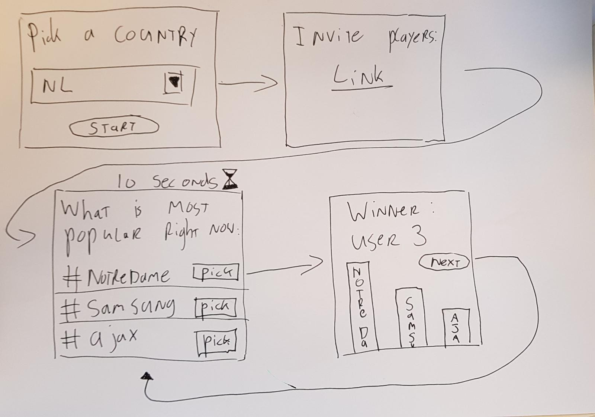

# Trending quiz

## Beschrijving concept

Ik wil icm de twitter API een quiz-achtige applicatie maken die gebruikers laat raden wat op dit moment het meest speelt (op Twitter, maar het liefst bij iedereen).

Het idee is dat de trending keywords/hashtags van twitter voor een bepaalde locatie worden opgevraagd. Vervolgens krijgen de spelers een aantal van deze termen te zien en kiest iedereen individueel welk van deze onderwerpen op dat moment populairder is.

Hiermee kun je een beetje kijken hoe goed mensen op de hoogte zijn en hoe goed ze kunnen inschatten waar mensen op Twitter mee bezig zijn.

Eventueel kan na elke ronde nog een aantal voorbeeldtweets getoond worden om gebruikers inzicht te geven in waarom juist dat fenomeen zo populair is op een bepaald moment.

Het realtime gedeelte is dat meerdere spelers antwoorden kunnen geven en dat je kunt zien wat de anderen gegokt hadden na elke ronde.

## Beschrijving API

Twitter API. Ik heb tot nu toe geëxperimenteerd met een aantal endpoints en ervoor gekozen trends/place te gebruiken. Hierbij kun je voor bepaalde locaties de trending topics bekijken door een locatie ID mee te geven (NL is bijvoorbeeld 23424909)

## User flow

## Twijfel/feedbackpunten

- Concept, is dit een goed concept om uit te werken
- Suggesties

issues open